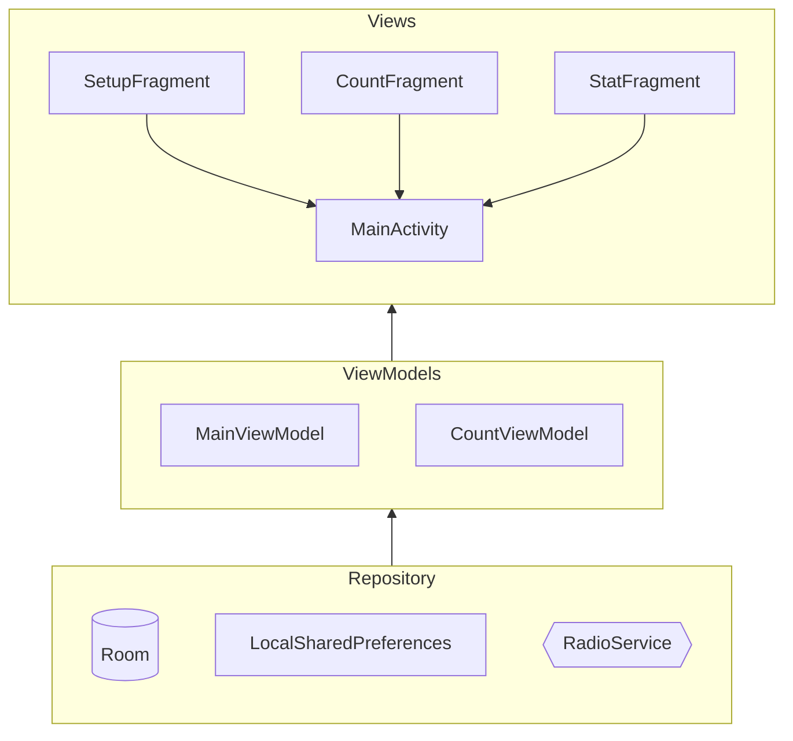

# Fitness-Music-Counter
A simple android application for workout counting with radio music

# Basic Architecture
This project based on MVVM architecture with dagger Hilt.

Views = Main Acitivity, Setup Fragment, Count Fragment, Statistics Fragment

ViewModels = Shared ViewModel, Count Fragment View Model

Models = ROOM database, Shared Preferences, Radio Service

# Radio sources
All radio streams from NRJ radio
